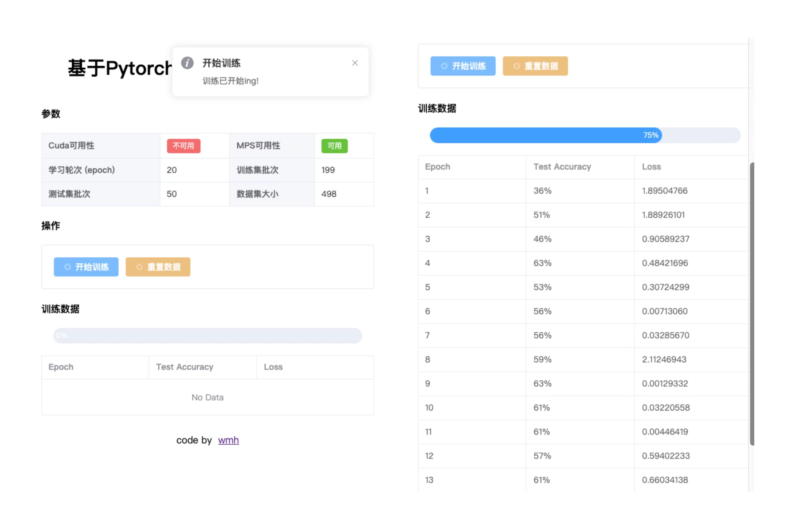
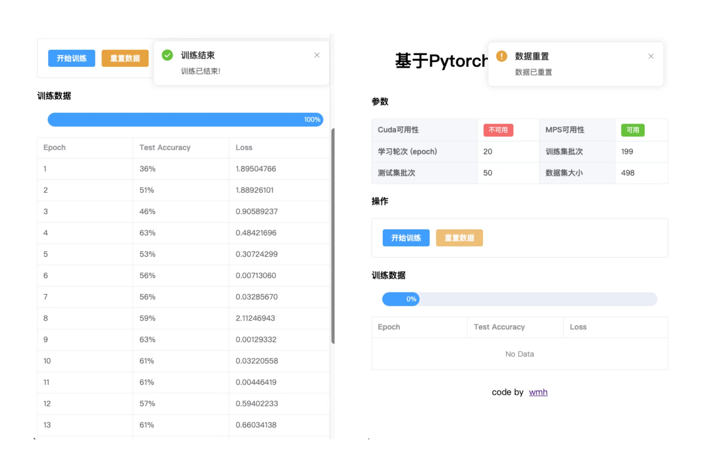

# 手写数字识别 - 前端

<!-- PROJECT SHIELDS -->
[![Contributors][contributors-shield]][contributors-url]
[![Forks][forks-shield]][forks-url]
[![Stargazers][stars-shield]][stars-url]
[![MIT License][license-shield]][license-url]
<!-- PROJECT LOGO -->
<br />

<p align="center">
  <a href="https://github.com/wmh1024/HandwrittenNumeral-FrontEnd">
    
  </a>

<h3 align="center">手写数字识别 - 前端</h3>
  <p align="center">
    本项目基于<a href="https://github.com/wmh1024/HandwrittenNumeralRecognition">「基于pytorch的手写数字识别」</a>二次开发。
    <br />
    前端使用Vue框架，后端使用Flask框架。
</p>

## 项目介绍

本项目基于[「基于pytorch的手写数字识别」](https://github.com/wmh1024/HandwrittenNumeralRecognition)二次开发，使用Flask框架作为后端，前端使用Vue框架。

- 项目前端：https://github.com/wmh1024/HandwrittenNumeral-FrontEnd
- 项目后端：https://github.com/wmh1024/HandwrittenNumeral-BackEnd

## 预览图





## 上手指南

克隆此项目

```sh
git clone https://github.com/wmh1024/HandwrittenNumeral-FrontEnd.git
```

下载依赖

```sh
yarn
```

开发运行

```sh
yarn run dev
```

生产打包

```sh
yarn run build
```

## 使用到的框架

- Vue3
- element-plus 组件库

## 开发者

- [wmh](https://github.com/wmh1024)

*您也可以在贡献者名单中参看其他参与该项目的开发者。*

## 联系我

wmh's wiki : https://wmhwiki.cn

## 如何参与开源项目

贡献使开源社区成为一个学习、激励和创造的绝佳场所。你所作的任何贡献都是**非常感谢**的。

1. Fork the Project
2. Create your Feature Branch (`git checkout -b feature/AmazingFeature`)
3. Commit your Changes (`git commit -m 'Add some AmazingFeature'`)
4. Push to the Branch (`git push origin feature/AmazingFeature`)
5. Open a Pull Request

## 版本控制

该项目使用 Git 进行版本管理。您可以在`repository`参看当前可用版本。

## 版权说明

该项目签署了MIT授权许可，详情请参阅 [LICENSE.txt](https://github.com/wmh1024/HandwrittenNumeral-FrontEnd/blob/main/LICENSE.txt)

<!-- links -->

[your-project-path]:wmh1024/HandwrittenNumeral-FrontEnd

[contributors-shield]: https://img.shields.io/github/contributors/wmh1024/HandwrittenNumeral-FrontEnd.svg?style=flat-square

[contributors-url]: https://github.com/wmh1024/HandwrittenNumeral-FrontEnd/graphs/contributors

[forks-shield]: https://img.shields.io/github/forks/wmh1024/HandwrittenNumeral-FrontEnd.svg?style=flat-square

[forks-url]: https://github.com/wmh1024/HandwrittenNumeral-FrontEnd/network/members

[stars-shield]: https://img.shields.io/github/stars/wmh1024/HandwrittenNumeral-FrontEnd.svg?style=flat-square

[stars-url]: https://github.com/wmh1024/HandwrittenNumeral-FrontEnd/stargazers

[issues-shield]: https://img.shields.io/github/issues/wmh1024/HandwrittenNumeral-FrontEnd.svg?style=flat-square

[issues-url]: https://img.shields.io/github/issues/wmh1024/HandwrittenNumeral-FrontEnd.svg

[license-shield]: https://img.shields.io/github/license/wmh1024/HandwrittenNumeral-FrontEnd.svg?style=flat-square

[license-url]: https://github.com/wmh1024/HandwrittenNumeral-FrontEnd/blob/main/LICENSE.txt

[linkedin-shield]: https://img.shields.io/badge/-LinkedIn-black.svg?style=flat-square&logo=linkedin&colorB=555

[linkedin-url]: https://linkedin.com/in/shaojintian
